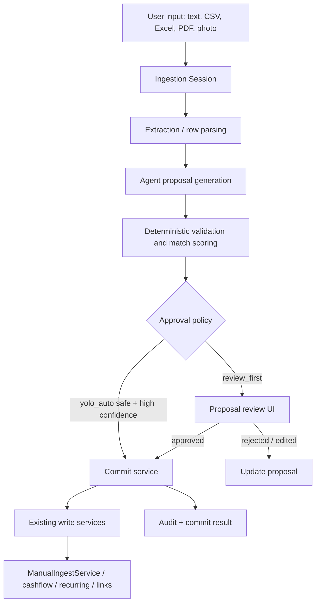

# Ingestion Agent Implementation Plan

## Context

The desktop app already has most of the primitives needed for an AI-first ingestion workflow:

- Canonical transaction storage in `transactions` and `transaction_items`.
- Manual and agent ingestion through `ManualIngestService`.
- Existing connector transactions from Amazon, Lidl, and other receipt sources.
- Document storage and OCR upload paths.
- Chat/Pi-agent runtime and model configuration.
- OpenClaw/Pi-agent tool adapter with read tools and safe-write actions.
- Cashflow and recurring bill domains that can represent non-receipt spending and repeated obligations.

The missing product layer is a dedicated ingestion workspace where the agent turns messy user input into proposed structured actions, checks existing data to avoid duplicates, and either asks for approval or auto-commits high-confidence safe actions when YOLO Auto is enabled.

This plan intentionally optimizes for speed and product learning. There is no current user base, so migrations should be simple but not over-engineered. If a migration becomes awkward during development, resetting the dev database and re-syncing Amazon/Lidl is acceptable.

## Product Direction

Build an **Ingestion Agent** as a dedicated left-nav workspace.

Primary promise:

> Drop, paste, type, or photograph anything. The agent turns it into proposed expenses, matches, recurring bills, or ignored rows.

Core rule:

> The model proposes. The deterministic backend validates and commits.

Supported user inputs:

- Free text: "I paid 25 euros cash for ice cream today."
- Pasted rows from a bank or credit-card statement.
- CSV bank exports.
- Excel exports.
- PDF statements.
- Photos or screenshots of receipts, invoices, and recurring bills.

Supported outcomes:

- Create transaction.
- Create cashflow entry.
- Link imported row to an existing connector transaction.
- Mark row as already covered.
- Propose recurring bill.
- Link to recurring occurrence.
- Ignore internal transfers, refunds, noise, or duplicates.
- Ask the user for clarification.

Approval modes:

- `review_first`: default; every proposed action requires user approval.
- `yolo_auto`: optional setting; safe high-confidence proposals can commit automatically, ambiguous rows still go to review.

## Non-Goals

- Do not build a bespoke parser for every bank.
- Do not let the model directly mutate tables as an invisible side effect.
- Do not replace existing connector sync.
- Do not create a second canonical transaction system.
- Do not make PDF/image extraction perfect before shipping CSV/text workflows.
- Do not over-invest in backwards-compatible migrations while there is no user base.

## Architecture

The ingestion agent sits above existing domain APIs and services.



The model should only create or update proposals. Commits should be performed by deterministic backend code after schema validation and approval policy checks.

## Data Model

Start with real tables rather than JSON-only blobs. The CSV workflow benefits from queryable rows and proposal states.

### `ingestion_sessions`

- `id`
- `user_id`
- `shared_group_id`
- `title`
- `input_kind`
- `approval_mode`
- `status`
- `summary_json`
- `created_at`
- `updated_at`

Suggested statuses:

- `draft`
- `extracting`
- `proposing`
- `reviewing`
- `committing`
- `completed`
- `failed`
- `archived`

### `ingestion_files`

- `id`
- `session_id`
- `storage_uri`
- `file_name`
- `mime_type`
- `sha256`
- `metadata_json`
- `created_at`

### `statement_rows`

- `id`
- `session_id`
- `file_id`
- `row_index`
- `row_hash`
- `occurred_at`
- `booked_at`
- `payee`
- `description`
- `amount_cents`
- `currency`
- `raw_json`
- `status`
- `created_at`
- `updated_at`

Suggested statuses:

- `parsed`
- `matched`
- `new_expense`
- `recurring_candidate`
- `ignored`
- `needs_review`
- `committed`
- `failed`

### `ingestion_proposals`

- `id`
- `session_id`
- `statement_row_id`
- `type`
- `status`
- `confidence`
- `payload_json`
- `explanation`
- `model_metadata_json`
- `commit_result_json`
- `error`
- `created_at`
- `updated_at`

Suggested types:

- `create_transaction`
- `create_cashflow_entry`
- `link_existing_transaction`
- `already_covered`
- `create_recurring_bill`
- `create_recurring_bill_candidate`
- `link_recurring_occurrence`
- `ignore`
- `needs_review`

Suggested statuses:

- `draft`
- `pending_review`
- `auto_approved`
- `approved`
- `committing`
- `committed`
- `rejected`
- `failed`

### `ingestion_proposal_matches`

- `id`
- `proposal_id`
- `transaction_id`
- `score`
- `reason_json`
- `selected`
- `created_at`

This table is optional in Sprint 1. It becomes useful once statement matching is implemented.

## Proposal Payload Contracts

### Create Transaction

```json
{
  "type": "create_transaction",
  "purchased_at": "2026-04-29T15:00:00+02:00",
  "merchant_name": "Ice Cream Store",
  "total_gross_cents": 2500,
  "currency": "EUR",
  "source_id": "agent_ingest",
  "source_display_name": "Agent Ingestion",
  "source_account_ref": "cash",
  "source_transaction_id": null,
  "idempotency_key": "session-row-or-message-derived-key",
  "confidence": 0.93,
  "items": [],
  "discounts": [],
  "raw_payload": {
    "input_kind": "free_text",
    "evidence": "I paid 25 euros cash at the ice cream store."
  }
}
```

Commit path: `ManualIngestService`.

### Link Existing Transaction

```json
{
  "type": "link_existing_transaction",
  "statement_row_id": "row-id",
  "transaction_id": "existing-transaction-id",
  "match_score": 0.97,
  "match_reason": {
    "amount": "exact",
    "date": "same_day",
    "merchant": "payee contains Amazon"
  }
}
```

Commit path: reconciliation/link metadata. If a dedicated link table does not exist yet, use proposal commit metadata first, then add a real link table when needed.

### Already Covered

```json
{
  "type": "already_covered",
  "statement_row_id": "row-id",
  "transaction_id": "existing-transaction-id",
  "confidence": 0.96,
  "reason": "Statement charge matches existing Amazon connector transaction by amount and date."
}
```

### Create Cashflow Entry

```json
{
  "type": "create_cashflow_entry",
  "effective_date": "2026-04-29",
  "direction": "outflow",
  "category": "cash",
  "amount_cents": 2500,
  "currency": "EUR",
  "description": "Cash payment at ice cream store",
  "source_type": "agent_ingest",
  "linked_transaction_id": null
}
```

Commit path: existing cashflow service/API.

### Create Recurring Bill Candidate

```json
{
  "type": "create_recurring_bill_candidate",
  "name": "Vodafone",
  "merchant_canonical": "Vodafone",
  "amount_cents": 3999,
  "currency": "EUR",
  "frequency": "monthly",
  "first_seen_date": "2026-04-01",
  "evidence": "Invoice text says monthly and statement shows similar prior charge.",
  "confidence": 0.88
}
```

Default behavior: review first, even in YOLO Auto. Create active recurring bills only after user approval until the workflow has proven reliable.

## API Surface

### Sessions

- `POST /api/v1/ingestion/sessions`
- `GET /api/v1/ingestion/sessions`
- `GET /api/v1/ingestion/sessions/{session_id}`
- `PATCH /api/v1/ingestion/sessions/{session_id}`
- `DELETE /api/v1/ingestion/sessions/{session_id}`

### Messages and Agent Runs

- `POST /api/v1/ingestion/sessions/{session_id}/message`
- `POST /api/v1/ingestion/sessions/{session_id}/run`

The implementation can reuse chat thread persistence internally, but the ingestion API should expose ingestion-specific concepts.

### Files and Rows

- `POST /api/v1/ingestion/sessions/{session_id}/files`
- `POST /api/v1/ingestion/files/{file_id}/parse`
- `GET /api/v1/ingestion/sessions/{session_id}/rows`
- `PATCH /api/v1/ingestion/rows/{row_id}`

### Proposals

- `GET /api/v1/ingestion/sessions/{session_id}/proposals`
- `POST /api/v1/ingestion/sessions/{session_id}/proposals`
- `PATCH /api/v1/ingestion/proposals/{proposal_id}`
- `POST /api/v1/ingestion/proposals/{proposal_id}/approve`
- `POST /api/v1/ingestion/proposals/{proposal_id}/reject`
- `POST /api/v1/ingestion/proposals/{proposal_id}/commit`
- `POST /api/v1/ingestion/proposals/batch-approve`
- `POST /api/v1/ingestion/proposals/batch-commit`
- `POST /api/v1/ingestion/proposals/batch-reject`

### Settings

- `GET /api/v1/settings/ingestion-agent`
- `POST /api/v1/settings/ingestion-agent`

Suggested settings:

```json
{
  "approval_mode": "review_first",
  "auto_commit_confidence_threshold": 0.95,
  "auto_link_confidence_threshold": 0.98,
  "auto_ignore_confidence_threshold": 0.98,
  "auto_create_recurring_enabled": false
}
```

## Agent Tooling

Create a dedicated ingestion tool set instead of reusing the analyst prompt directly.

Initial tools:

- `search_transactions`
- `get_transaction_detail`
- `search_match_candidates`
- `create_ingestion_proposal`
- `update_ingestion_proposal`
- `render_ingestion_summary`

Later tools:

- `parse_statement_preview`
- `classify_statement_rows`
- `commit_ingestion_proposal`
- `batch_commit_ingestion_proposals`
- `create_recurring_bill_candidate`

The agent should not receive direct low-level DB tools. Commit tools must enforce approval policy and backend validation.

## Prompt Requirements

The ingestion agent system prompt should include:

- Same-language response behavior.
- Never fabricate missing dates, totals, or merchants.
- Always distinguish extracted facts from guesses.
- Always search for existing transactions before proposing a new transaction when input contains a merchant/date/amount.
- Prefer `already_covered` or `link_existing_transaction` over duplicate creation when existing connector data matches.
- For unclear rows, create `needs_review`.
- For recurring patterns, create a recurring candidate, not an active recurring bill, unless explicitly approved.
- Never auto-delete or overwrite existing data.
- Store enough evidence for user review.

## YOLO Auto Policy

YOLO Auto should be optional, visible, and constrained.

Allowed auto-commits:

- `create_transaction` when confidence is above threshold and no high-scoring existing match exists.
- `link_existing_transaction` when deterministic match score is above threshold.
- `already_covered` when deterministic match score is above threshold.
- `ignore` when row is an obvious internal transfer/noise/refund and confidence is above threshold.

Not allowed initially:

- Auto-delete.
- Auto-overwrite.
- Auto-create active recurring bills.
- Auto-link ambiguous matches.
- Auto-commit rows with missing date, amount, or merchant/payee.

Every auto-commit must write:

- Proposal id.
- Approval mode.
- Confidence.
- Deterministic score.
- Commit result.
- Audit event.

The UI must show a persistent YOLO Auto indicator in the ingestion workspace when enabled.

## Sprint 0: Research, Alignment, and Guardrails

Goal: prepare the implementation without changing product behavior.

Tasks:

- Re-read the relevant backend services:
  - `ManualIngestService`
  - transaction search/detail APIs
  - cashflow services
  - recurring bill services
  - chat/Pi-agent config
  - OpenClaw tool adapter
  - document storage/OCR upload
- Confirm whether current migrations are managed by Alembic and how desktop prepares the local DB.
- Decide whether ingestion uses separate tables immediately or JSON blobs in proposals for Sprint 1.
- Decide whether session chat persistence should reuse `chat_threads` or use separate ingestion-specific session tables.
- Draft the first ingestion agent prompt.
- Confirm left-nav route naming: `/ingestion`.

Acceptance:

- No code behavior changes.
- Clear list of files/modules to edit in Sprint 1.
- Database reset policy is documented for local dev.

## Sprint 1: Proposal Contract and Manual Text Intake

Goal: prove the simplest valuable loop.

Example:

> I paid 25 euros cash at the ice cream store today.

Expected result:

- Agent proposes a transaction.
- User reviews it.
- User approves.
- Backend creates the transaction through `ManualIngestService`.

Backend tasks:

- Add ingestion proposal/session models.
- Add simple migrations if straightforward.
- Add ingestion API routes for sessions, messages, proposals, approve, reject, and commit.
- Add proposal validation with strict schemas.
- Add commit service for `create_transaction`.
- Use `ManualIngestService`; do not direct-write `transactions`.
- Write audit events for approval and commit.
- Generate deterministic idempotency keys for free-text proposals.

Frontend tasks:

- Add `/ingestion` route and left-nav item.
- Build two-pane workspace:
  - input thread
  - proposal review list
- Add proposal card for `create_transaction`.
- Allow editing merchant/date/amount/currency/source before approval.
- Add approve/reject/commit controls.
- Show commit result.

Agent tasks:

- Create `createIngestionAgent`.
- Add ingestion-specific system prompt.
- Give the agent proposal tools only.
- Keep direct commit out of the model path for Sprint 1.

Tests:

- Backend proposal validation tests.
- Backend commit tests through `ManualIngestService`.
- Frontend route smoke test.
- Frontend approve/commit UI test.

Acceptance:

- Text input produces a reviewable transaction proposal.
- Approved proposal creates exactly one transaction.
- Re-running commit with same idempotency key does not duplicate.
- Rejected proposal does not write a transaction.

## Sprint 2: Existing Transaction Matching

Goal: avoid duplicates against connector transactions.

Backend tasks:

- Add deterministic match candidate service.
- Candidate inputs:
  - date
  - amount
  - merchant/payee
  - source hint
  - description
- Matching rules:
  - exact amount gets high weight.
  - same day gets high weight.
  - plus/minus 2 days gets medium weight.
  - merchant/payee similarity adjusts score.
  - source hints can boost or lower score.
- Add `ingestion_proposal_matches` or embed matches in proposal JSON if Sprint 1 used a lighter model.
- Add proposal types:
  - `already_covered`
  - `link_existing_transaction`
- Add API to refresh match candidates for a proposal or row.

Frontend tasks:

- Show candidate matches in proposal cards.
- Add "Already covered" action.
- Add "Create new anyway" action.
- Show confidence and reason.
- Add visual distinction for matched/new/needs-review rows.

Agent tasks:

- Require search/match tool before creating a new transaction when date and amount are known.
- Let the backend score candidates; model may explain but not own the score.

Tests:

- Exact Amazon/Lidl match.
- Same amount but different merchant.
- Same merchant but different amount.
- Ambiguous multiple candidates.
- No candidate, create new.

Acceptance:

- Statement-like row for existing Amazon/Lidl transaction is marked covered instead of duplicated.
- Ambiguous rows stay in review.
- User can override match suggestion.

## Sprint 3: CSV, Excel, and Pasted Table Intake

Goal: support monthly bank/credit-card reconciliation.

Backend tasks:

- Add ingestion file upload endpoint.
- Store file metadata and hash.
- Add CSV parser using structured parsing.
- Add spreadsheet parsing if existing bundled dependencies make it easy.
- Add `statement_rows`.
- Add column mapping inference:
  - deterministic for common names.
  - agent-assisted for unknown headers.
- Add row hash/idempotency key based on file hash plus normalized row.
- Add classify/propose action for rows.

Frontend tasks:

- Add drop zone and file picker.
- Add paste-table area.
- Add parsed row preview.
- Add column mapping confirmation for uncertain files.
- Add row table with statuses.
- Add batch approve for high-confidence rows.

Agent tasks:

- Given headers and sample rows, infer column roles.
- Classify rows:
  - existing match
  - new expense
  - recurring candidate
  - internal transfer/ignore
  - needs review
- Produce proposals through tools.

Tests:

- CSV with normal headers.
- CSV with German bank-style headers.
- Negative/positive amount conventions.
- Duplicate upload of same file.
- Empty/invalid file.

Acceptance:

- User can upload a CSV.
- Rows are parsed and classified.
- Existing connector matches are not duplicated.
- User can batch-commit selected proposals.

## Sprint 4: YOLO Auto

Goal: optional low-friction ingestion mode.

Backend tasks:

- Add ingestion-agent settings.
- Add `IngestionApprovalPolicy`.
- Route every proposal through policy.
- Implement safe auto-commit for high-confidence proposals.
- Record audit events for all auto-commits.
- Add "auto_approved" status.

Frontend tasks:

- Add settings UI:
  - `Review First`
  - `YOLO Auto`
  - thresholds
- Add warning copy when enabling YOLO Auto.
- Add persistent indicator in ingestion workspace.
- Add "Review auto-committed" filter.

Tests:

- Review First never auto-commits.
- YOLO Auto commits high-confidence safe create.
- YOLO Auto refuses ambiguous match.
- YOLO Auto does not create recurring bill automatically.
- YOLO Auto writes audit records.

Acceptance:

- User can enable YOLO Auto.
- High-confidence safe rows commit automatically.
- Unclear rows stay in review.

## Sprint 5: PDF, Image, Photo, and Screenshot Intake

Goal: allow users to drop bills, photos, screenshots, and PDFs without relying only on OCR.

Backend tasks:

- Reuse document storage where possible.
- Accept images and PDFs as ingestion files.
- Store source artifact metadata.
- Add extraction proposal path for unstructured documents.
- Preserve original file hash and storage URI.
- Keep existing OCR path intact.

Agent tasks:

- Extract:
  - merchant/payee
  - date
  - total
  - currency
  - line items if visible
  - recurrence hints
  - evidence
  - confidence
- Create proposals, not direct writes.
- Mark missing/unclear fields as `needs_review`.

Frontend tasks:

- Show source artifact preview when possible.
- Show extracted fields alongside proposal.
- Let user edit and approve.
- For images/PDFs, show extraction confidence and evidence text.

Tests:

- Image upload creates proposal.
- PDF upload creates proposal.
- Missing amount stays in review.
- Recurring bill photo creates recurring candidate.

Acceptance:

- User drops a bill photo.
- Agent proposes a transaction.
- User approves and transaction is committed.
- Recurring-looking bill creates a recurring candidate.

## Sprint 6: Recurring Bill Integration

Goal: make "this is monthly" useful.

Backend tasks:

- Add proposal types:
  - `create_recurring_bill`
  - `link_recurring_occurrence`
- Add recurring detection service.
- Detect:
  - same/similar merchant
  - similar amount
  - monthly cadence
  - text cues in invoices
  - known utility/subscription patterns
- Use existing recurring services where possible.
- Add commit path for approved recurring bill creation.
- Add recurring occurrence link proposal.

Frontend tasks:

- Add recurring proposal card.
- Show:
  - name
  - merchant pattern
  - amount
  - cadence
  - next due date
  - evidence
- Let user choose:
  - create transaction only
  - create recurring bill too
  - mark as one-off

Tests:

- Monthly invoice creates recurring candidate.
- One-off purchase does not.
- Similar statement rows suggest recurrence.
- YOLO Auto does not create active recurring bill unless setting explicitly allows it.

Acceptance:

- User can approve transaction plus recurring bill from one workflow.
- Future statement rows can be linked to recurring occurrences.

## Sprint 7: Batch Review UX

Goal: make 100-row monthly reconciliation pleasant.

Frontend tasks:

- Group proposals by:
  - ready to commit
  - needs review
  - matched existing
  - ignored
  - failed
- Add filters:
  - status
  - type
  - merchant
  - amount
  - source/file
- Add bulk actions:
  - approve selected
  - reject selected
  - commit approved
  - approve all high-confidence creates
  - approve all high-confidence matches
- Add keyboard-friendly review controls.
- Add session summary.

Backend tasks:

- Add batch endpoints.
- Add commit progress/result summary.
- Add pagination for rows/proposals.
- Add re-run agent on unresolved rows.

Tests:

- Batch approve/commit selected.
- Pagination preserves selection.
- Failed row does not block unrelated rows.

Acceptance:

- 100-row CSV can be reviewed without opening every proposal manually.

## Sprint 8: Undo, Repair, and Trust

Goal: make YOLO Auto and batch import less scary.

Backend tasks:

- Store complete commit metadata for every proposal.
- Add reversible commit support:
  - delete transactions created by ingestion session if no external dependencies block deletion.
  - unlink statement rows from existing transactions.
  - mark recurring bills inactive or delete if newly created and unused.
- Add session-level undo endpoint.
- Add audit events for undo.

Frontend tasks:

- Add session history.
- Add "Review committed actions" view.
- Add "Undo session" where reversible.
- Add "Why did the agent do this?" detail view.

Tests:

- Undo newly created transaction.
- Undo link.
- Undo refuses unsafe deletion and explains why.
- Audit history includes original commit and undo.

Acceptance:

- User can review and undo recent ingestion-session changes.

## Sprint 9: Hardening, Tool Cleanup, and Release Readiness

Goal: make the workflow maintainable and testable.

Backend tasks:

- Promote ingestion tools into a clean local tool set.
- Add strict schemas for all proposal tools.
- Add golden tests for matching.
- Add robust file parsing error states.
- Add diagnostics that avoid leaking personal data.
- Remove temporary debug logs.
- Confirm side-repo isolation: no `../../` runtime/build dependencies.

Frontend tasks:

- Polish loading states and empty states.
- Add localized strings.
- Add accessibility checks.
- Add responsive layout.
- Add route-level tests.

Agent tasks:

- Reduce prompt size.
- Make tool call behavior deterministic.
- Add examples in prompt for:
  - cash expense
  - Amazon statement match
  - ambiguous bank row
  - recurring utility bill
  - internal transfer

Verification:

- `npm run typecheck`
- `npm run build`
- Relevant backend tests.
- Relevant frontend tests.
- Manual run with dev DB.
- CSV smoke test.
- Free-text smoke test.
- YOLO Auto smoke test.

Acceptance:

- Feature is usable end-to-end.
- Build passes.
- Ingestion agent is behind settings/feature flag if not ready for default exposure.

## Migration and Reset Policy

During development:

- Prefer simple Alembic migrations when straightforward.
- If a migration becomes awkward, reset local dev DB.
- It is acceptable to re-sync Amazon and Lidl.
- Do not spend time preserving half-baked prototype tables.

Before any public release:

- Stabilize table names and proposal schemas.
- Ensure migrations can create all required tables from a fresh install.
- Ensure upgrade from the last public schema works if public users exist by then.

## Quality Gates

Every sprint that touches code should satisfy:

- No runtime/build-time dependency on `../../*` paths.
- Desktop remains standalone.
- `npm run typecheck`.
- `npm run build`.
- Targeted tests for changed backend/frontend behavior.
- No personal data in diagnostics or logs.
- Model output is validated before commit.
- Commits are idempotent.
- Audit events exist for writes.

## Complete Orchestration Agent Prompt

Use this prompt to run an implementation agent from Sprint 0 through Sprint 9.

```text
You are the implementation orchestration agent for the Outlays/LidlTool desktop repository at /Volumes/macminiExtern/projects/lidltool-desktop.

Your mission is to implement the complete Ingestion Agent plan from docs/ingestion-agent-implementation-plan.md, starting at Sprint 0 and continuing through the final hardening sprint. Work sprint-by-sprint. Do not skip ahead unless a later task is clearly required to finish the current sprint safely.

Repository constraints:
- This is a standalone desktop side repo.
- Do not add runtime or build-time dependencies on ../../* paths.
- Do not import or execute code from the main repo at runtime.
- Everything needed by desktop runtime must live inside this repo.
- Packaging config must only reference paths inside this repo.
- Keep desktop-specific docs in README.md plus docs/.
- Prefer local directories such as vendor/frontend, vendor/backend, scripts, and build.
- If there is a tradeoff between speed and side-repo isolation, choose isolation.

Product constraints:
- The ingestion agent is an AI-first intake layer above existing write APIs, not a new canonical ledger.
- The model proposes; deterministic backend code validates and commits.
- Do not let the model directly mutate the database as an invisible side effect.
- Default approval mode is Review First.
- YOLO Auto is optional and must be constrained to safe high-confidence actions.
- Never auto-delete or overwrite existing transactions.
- Do not auto-create active recurring bills in early sprints; create recurring candidates unless the user explicitly approves.
- Store enough evidence and audit data for user review.
- Use existing write paths whenever possible:
  - ManualIngestService for transactions.
  - Existing cashflow services/APIs for cashflow entries.
  - Existing recurring bill services/APIs for recurring bills.
  - Existing document storage where practical.

Migration policy:
- There is no external user base yet.
- Add simple migrations when straightforward.
- Do not over-engineer backwards compatibility.
- If schema churn makes migration awkward, document the reset and proceed. It is acceptable for the developer to nuke the dev DB and re-sync Amazon/Lidl.
- Before final hardening, ensure fresh install DB creation works.

Execution style:
1. Start by reading docs/ingestion-agent-implementation-plan.md.
2. Inspect the current codebase before editing.
3. Create a concise sprint execution checklist.
4. For each sprint:
   - Implement only that sprint's scope.
   - Add or update targeted tests.
   - Run the relevant tests.
   - Run npm run typecheck and npm run build when the sprint affects TypeScript/frontend/build behavior.
   - Update documentation if workflow, settings, or architecture changed.
   - Summarize completed work, changed files, verification results, and remaining risks.
5. Continue to the next sprint only after the current sprint is functionally complete or after documenting a clear blocker.

Suggested sprint order:
- Sprint 0: research, alignment, guardrails.
- Sprint 1: proposal contract and manual text intake.
- Sprint 2: existing transaction matching.
- Sprint 3: CSV, Excel, and pasted table intake.
- Sprint 4: YOLO Auto.
- Sprint 5: PDF, image, photo, and screenshot intake.
- Sprint 6: recurring bill integration.
- Sprint 7: batch review UX.
- Sprint 8: undo, repair, and trust.
- Sprint 9: hardening, tool cleanup, and release readiness.

Implementation guidance:
- Prefer existing patterns in overrides/backend and overrides/frontend.
- Keep changes scoped and testable.
- Add schema validation for every model-originated proposal.
- Keep idempotency keys deterministic.
- Add audit events for writes, auto-approvals, commits, rejects, and undo.
- Use structured parsers for CSV/spreadsheets; do not parse CSV with ad hoc string splitting.
- For bank rows, parse into staging rows first. Do not immediately write canonical transactions.
- For matching, backend deterministic score is authoritative. The model may explain but must not own the score.
- For frontend, build the actual ingestion workspace, not a marketing page.
- The ingestion UI should be task-first: input area, parsed rows/proposals, review/commit actions, session summary.
- Make YOLO Auto visible in the UI when enabled.
- Preserve privacy: do not log personal transaction contents, uploaded document text, screenshots, raw bank rows, or model prompts in diagnostics.

Minimum acceptance for the full plan:
- A user can open /ingestion.
- A user can type "I paid 25 euros cash at the ice cream store today."
- The agent creates a transaction proposal.
- The user can edit, approve, and commit it.
- The transaction is created via ManualIngestService.
- Re-running commit does not duplicate it.
- A bank CSV can be uploaded and parsed into statement rows.
- Rows can be matched against existing Amazon/Lidl connector transactions.
- Existing matches can be marked covered without duplicate transaction creation.
- New rows can become transaction proposals.
- YOLO Auto can auto-commit only safe high-confidence proposals.
- Ambiguous rows stay in review.
- A photo/PDF can produce a proposal through the AI intake path.
- Recurring-looking inputs can create recurring bill candidates.
- Batch review supports monthly reconciliation.
- Recent ingestion-session commits can be reviewed and, where safe, undone.
- npm run typecheck passes.
- npm run build passes.
- No new ../../ runtime/build references are introduced.

When uncertain:
- Choose the smallest implementation that preserves the proposal/approval/commit separation.
- Prefer Review First over YOLO Auto behavior.
- Prefer staging and review over direct canonical writes.
- Prefer using existing services over adding parallel domain logic.
- If a migration is painful, document that the dev DB can be reset and continue.
```

